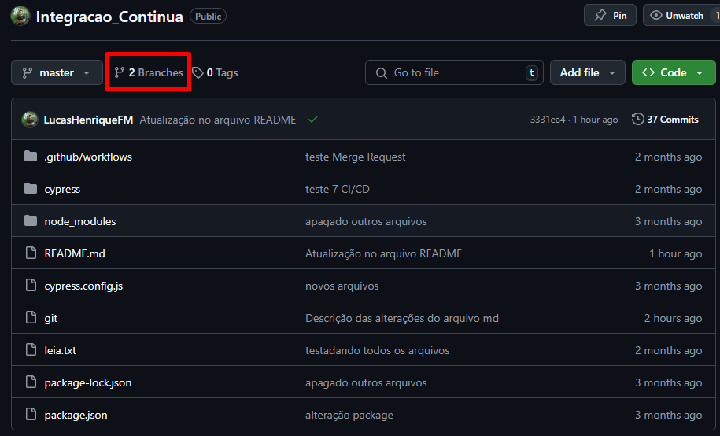
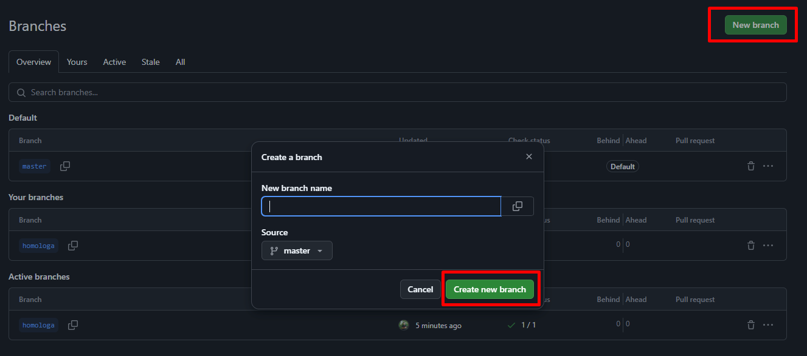

# Integração Contínua com GitHub Actions


### 1. Sobre o Projeto
Este projeto visa automatizar o processo de integração contínua (CI) utilizando o GitHub Actions. Ele permite que, sempre que um novo código seja enviado (via push ou pull request), testes automatizados sejam executados para garantir que o sistema continue funcionando corretamente e que novas mudanças não quebrem funcionalidades existentes. O objetivo é aumentar a eficiência e a qualidade do desenvolvimento, reduzindo o tempo de feedback para os desenvolvedores.


### 2. Finalidade da Integração Contínua
A integração contínua é uma prática fundamental no desenvolvimento de software moderno, que visa integrar as mudanças de código de forma contínua e automática. Ao configurar um pipeline de CI, todas as alterações realizadas no código são automaticamente verificadas através de testes e builds, evitando a introdução de erros no código base. Isso facilita a detecção precoce de problemas, melhora a colaboração entre os desenvolvedores e acelera o processo de entrega, garantindo que o código esteja sempre pronto para produção.

Esse processo de integração contínua garante que a equipe de desenvolvimento tenha mais confiança nas mudanças feitas no código, contribuindo para um fluxo de trabalho mais ágil e produtivo.

### 3. Como executar a automação da Integração Contínua

#### 3.1 Criar uma Branch nova
- Dentro do Projeto no GitHub, clicar em Branches e depois New branch, digitar o nome da branch, e clicar em create new branch
  
  
- No Terminal digitar o comando `git checkout homologa`
- Comando para saber em qual branch você está `git branch`


#### 3.2 Criar um Pull Request (PR)
- Quando você fizer alterações no código e quiser testá-las, crie uma nova branch e um Pull Request (PR) no GitHub.
- O workflow de integração contínua será automaticamente acionado ao abrir o PR, e os testes serão executados conforme configurado.


### 1. Criar um Pull Request
- Acesse o repositório no GitHub
- Clique em **Compare & Pull Request**
- Descreva as alterações


### 2. Configuração do Workflow
- Arquivo de workflow: `.github/workflows/[nome-do-arquivo].yml`
- Instalar dependências
- Executar testes automatizados

### 3. Comandos para Subir a Nova Versão para o Git
- Criar uma nova branch
- Commit e push da nova branch
- Comandos:
  ```
  git checkout -b nome-da-branch (mudar a branch)
  git add . (adicionar alteração)
  git commit -m "Descrição" (fazer comentário)
  git push origin nome-da-branch (subir atualização para a branch)
  ```