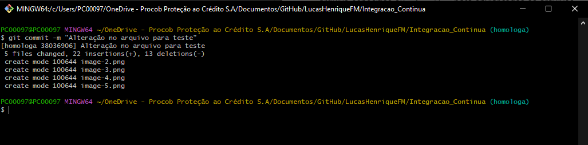

# Integração Contínua com GitHub Actions


### 1. Sobre o Projeto
Este projeto visa automatizar o processo de integração contínua (CI) utilizando o GitHub Actions. Ele permite que, sempre que um novo código seja enviado (via push ou pull request), testes automatizados sejam executados para garantir que o sistema continue funcionando corretamente e que novas mudanças não quebrem funcionalidades existentes. O objetivo é aumentar a eficiência e a qualidade do desenvolvimento, reduzindo o tempo de feedback para os desenvolvedores.


### 2. Finalidade da Integração Contínua
A integração contínua é uma prática fundamental no desenvolvimento de software moderno, que visa integrar as mudanças de código de forma contínua e automática. Ao configurar um pipeline de CI, todas as alterações realizadas no código são automaticamente verificadas através de testes e builds, evitando a introdução de erros no código base. Isso facilita a detecção precoce de problemas, melhora a colaboração entre os desenvolvedores e acelera o processo de entrega, garantindo que o código esteja sempre pronto para produção.

Esse processo de integração contínua garante que a equipe de desenvolvimento tenha mais confiança nas mudanças feitas no código, contribuindo para um fluxo de trabalho mais ágil e produtivo.

### 3. Como executar a automação da Integração Contínua

#### 3.1 Clonar o repositório da branch "homologa"
Primeiro passo que deve ser feito, é clonar o repositório do GitHub para a sua máquina.

- Abrir o terminal onde deseja criar o repositório


- Digitar o comando `git clone https://github.com/LucasHenriqueFM/Integracao_Continua.git` para criar o repositório

- Digitar o comando `cd Integracao_Continua` para entrar dentro da pasta do projeto


- Digitar o comando `git checkout homologa` para mudar a branch da master para homologa


- Verificar em qual branch você está, com o comando `git branch`


#### 3.2 Realizar alteração em algum arquivo
Após ter clonado o repositório do git, o próximo passo é fazer alguma ateração em qualquer arquivo.

#### 3.3 Subir a alteração para branch homologa
Após realizar a alteração, deve subir a alteração para a branch homologa

- Adicione o(s) arquivo(s) alterado(s) para o stage com o comando `git add nome_do_arquivo` para o arquivo especifico ou `git add .` para enviar todos os arquivos


- Faça o commit das alterações com uma mensagem descritiva com o comando `git commit -m "Descrição da alteração realizada"`


- Envie as alterações da branch homologa para o repositório remoto com o comando `git push origin homologa`


### 2. Configuração do Workflow
- Arquivo de workflow: `.github/workflows/[nome-do-arquivo].yml`
- Instalar dependências
- Executar testes automatizados
<<<<<<< HEAD
=======

### 3. Comandos para Subir a Nova Versão para o Git
- Criar uma nova branch
- Commit e push da nova branch
- Comandos:
  ```
  git checkout -b nome-da-branch (mudar a branch)
  git add . (adicionar alteração)
  git commit -m "Descrição" (fazer comentário)
  git push origin nome-da-branch (subir atualização para a branch)
  ```

  ### 4. apenas para testar o push na master


  teste
  teste
  teste
  teste

  teste
  teste


  teste
  teste
  teste


  asdasdsadasdasdasd
  asdasdadasdasdasdasdsad
  asdadasdasd
  
>>>>>>> 44676572520f201608b269ef4bb374b0252eb6a1
