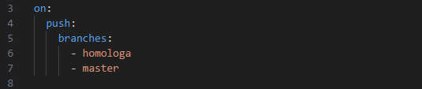

# Integração Contínua com GitHub Actions

### 1. Sobre o Projeto
Este projeto visa automatizar o processo de integração contínua (CI) utilizando o GitHub Actions. Ele permite que, sempre que um novo código seja enviado (via push ou pull request), testes automatizados sejam executados para garantir que o sistema continue funcionando corretamente e que novas mudanças não quebrem funcionalidades existentes. O objetivo é aumentar a eficiência e a qualidade do desenvolvimento, reduzindo o tempo de feedback para os desenvolvedores.

### 2. Finalidade da Integração Contínua
A integração contínua é uma prática fundamental no desenvolvimento de software moderno, que visa integrar as mudanças de código de forma contínua e automática. Ao configurar um pipeline de CI, todas as alterações realizadas no código são automaticamente verificadas através de testes e builds, evitando a introdução de erros no código base. Isso facilita a detecção precoce de problemas, melhora a colaboração entre os desenvolvedores e acelera o processo de entrega, garantindo que o código esteja sempre pronto para produção.

Esse processo de integração contínua garante que a equipe de desenvolvimento tenha mais confiança nas mudanças feitas no código, contribuindo para um fluxo de trabalho mais ágil e produtivo.

### 3. Como executar a automação da Integração Contínua

#### 3.1 Clonar o repositório da branch "homologa"
Primeiro passo que deve ser feito, é clonar o repositório do GitHub para a sua máquina.

- Abrir o terminal onde deseja criar o repositório

- Digitar o comando `git clone https://github.com/LucasHenriqueFM/Integracao_Continua.git` para criar o repositório

- Digitar o comando `cd Integracao_Continua` para entrar dentro da pasta do projeto

- Digitar o comando `git checkout homologa` para mudar a branch da master para homologa

- Verificar em qual branch você está, com o comando `git branch`

#### 3.2 Realizar alteração em algum arquivo
Após ter clonado o repositório do git, o próximo passo é fazer alguma ateração em qualquer arquivo.

#### 3.3 Subir a alteração para branch homologa
Após realizar a alteração, deve subir a alteração para a branch homologa

- Adicione o(s) arquivo(s) alterado(s) para o stage com o comando `git add nome_do_arquivo` para o arquivo especifico ou `git add .` para enviar todos os arquivos

- Faça o commit das alterações com uma mensagem descritiva com o comando `git commit -m "Descrição da alteração realizada"`

- Envie as alterações da branch homologa para o repositório remoto com o comando `git push origin homologa`

### 4. Configuração do Workflow
O arquivo workflow_cypress.yaml se econtra dentro da pasta .github/workflows

#### 4.1 Configuração inicial
 
• `name` Define o nome do workflow, neste caso, "Continuous Integration". Esse nome será exibido no painel de ações do Github

#### 4.2 Disparo do workflow
 
• `on`: Define os eventos que acionam esse workflow.
• `push`: Este workflow será executado sempre que houver um push (envio de alterações) nos branches especificados.
• `branches`: Lista os branches onde o workflow será disparado. Aqui, são os branches homologa e master.

#### 4.3 Definição de Jobs

• `jobs`: Define as tarefas (jobs) que serão executadas no workflow.
• `Continuous-integration`: Nome do job.
• `runs-on: ubuntu-latest`: Define o sistema operacional no qual o job será executado. Neste caso, a última versão do Ubuntu disponível.

#### 4.4 Passos do Job

• `steps`: Lista os passos do job.
• `uses: actions/checkout@v3`: Faz o checkout do repositório. Isso significa que o código-fonte do repositório será baixado para a máquina de execução.

#### 4.5 Configuração do Node.js

• `name: Set up Node.js`: Um passo com o nome "Set up Node.js".
• `uses: actions/setup-node@v2`: Usa a ação oficial do GitHub para configurar o Node.js.
• `with`: Define as configurações adicionais.
• `node-version: 20`: Especifica a versão do Node.js a ser usada (neste caso, a versão 20).

#### 4.6 Instalação das dependências

• `name: Install dependencies`: Um passo com o nome "Install dependencies".
• `run: npm install`: Executa o comando npm install para instalar as dependências do projeto listadas no arquivo package.json.

#### 4.7 Configuração de permissões para o Cypress

• `name: Set permissions for Cypress`: Um passo com o nome "Set permissions for Cypress".
• `run`: Executa o comando chmod +x para dar permissões de execução ao binário do Cypress na pasta node_modules.
• `|| true`: Garante que o workflow não falhe caso o comando retorne um erro (por exemplo, se o arquivo já tiver as permissões corretas).

#### 4.8 Instalação do binário do Cypress

• `name: Install Cypress binary`: Um passo com o nome "Install Cypress binary".
• `run: npx cypress install`: Executa o comando npx cypress install para baixar e instalar o binário necessário para rodar os testes do Cypress.

#### 4.9 Execução dos testes do Cypress

• `name: Run Cypress tests`: Um passo com o nome "Run Cypress tests".
• `run: npx cypress run`: Executa o comando npx cypress run, que inicia a execução dos testes configurados no Cypress.